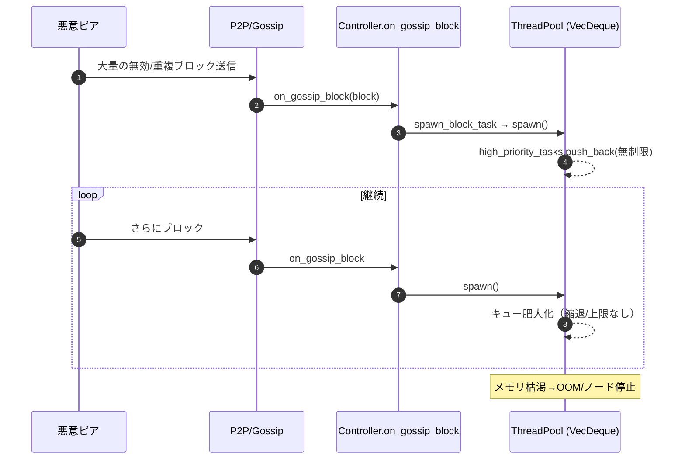
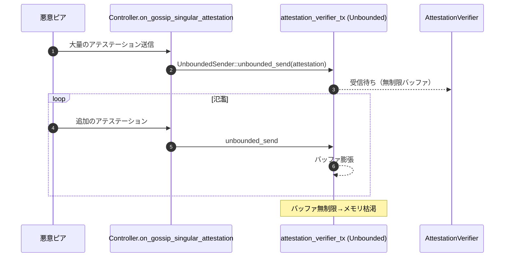
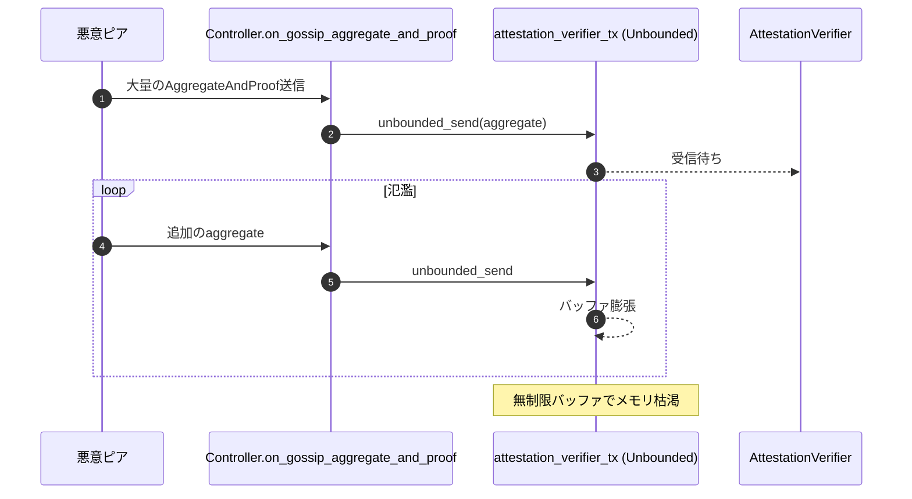
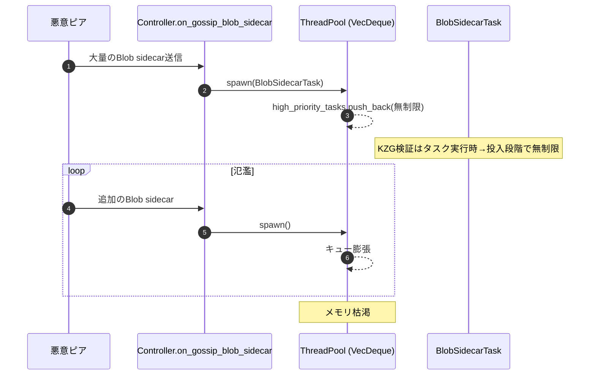
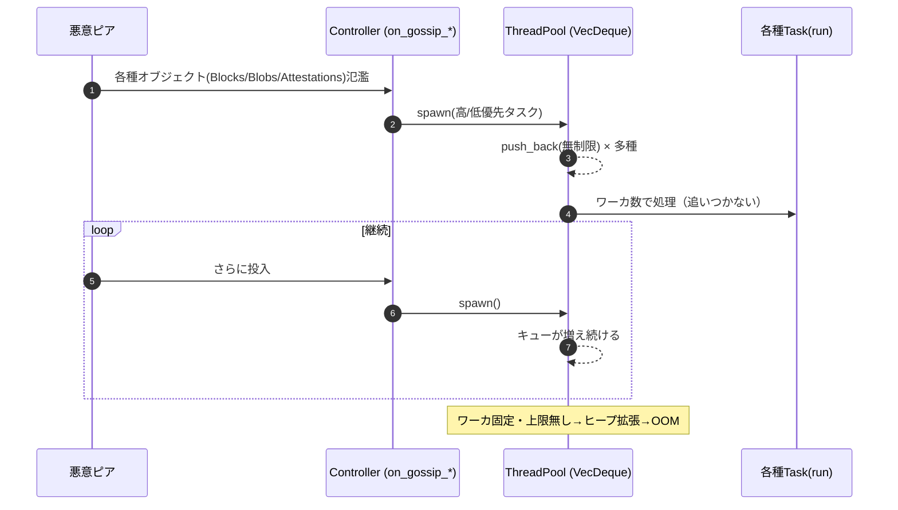
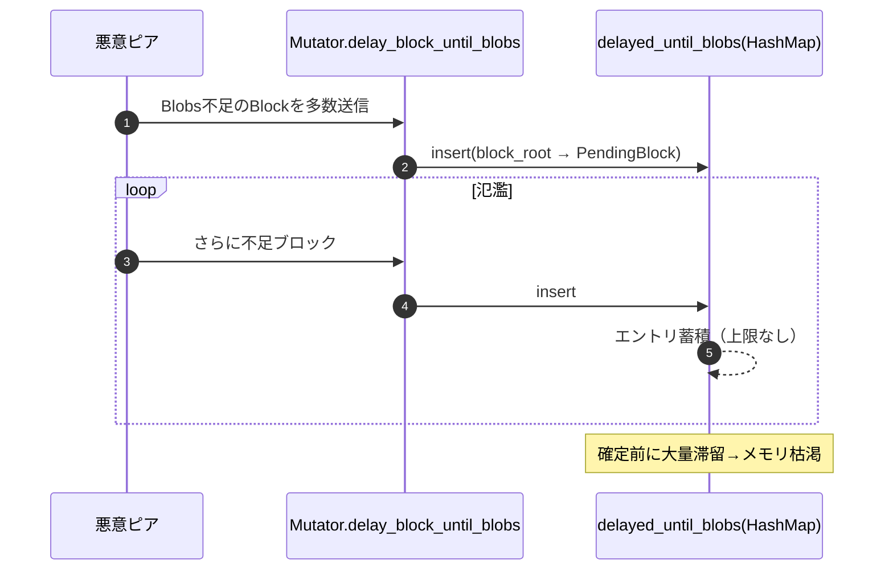
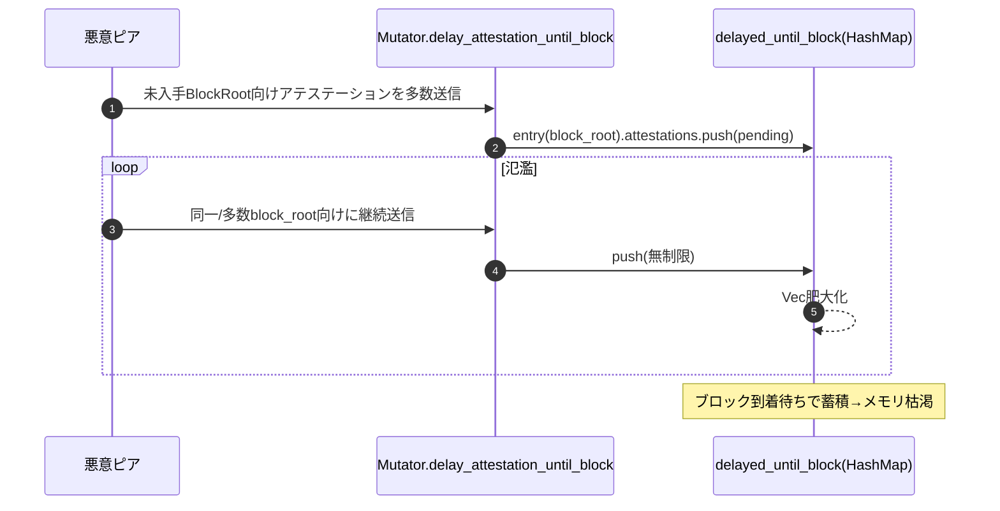
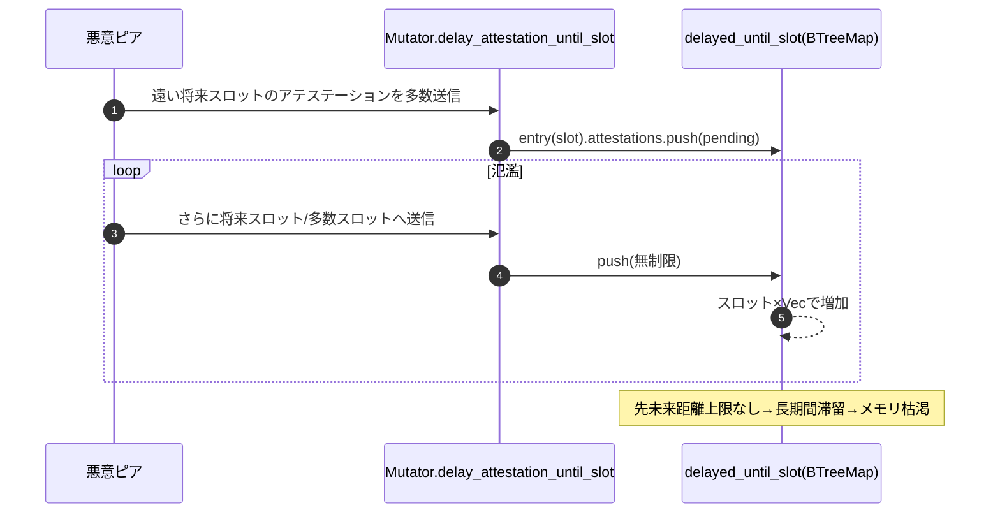

# DoS リスク再評価（FCC-DOS-001〜008）

## 1. 対象と結論
- 対象: Grandine のフォークチョイス系/検証系キューおよびタスク投入経路に関する DoS（メモリ枯渇）懸念（FCC-DOS-001〜008）。
- 結論: アプリ内にメモリ上限・キュー容量・バックプレッシャーが未実装で、プロセス外側の上限設定も既定では無い。従って各項目の DoS リスクは「高」または「中〜高」を維持。

## 2. メモリ制限・リミッター構成の現状
- アロケータ: `tikv-jemallocator` をグローバル使用（`allocator/src/lib.rs`）。上限制御（MALLOC_CONF 等）やハードキャップ未設定。
- チャネル: `futures::channel::mpsc::unbounded()` を広範に使用（例: `runtime/src/runtime.rs`, `http_api/src/context.rs`）。無制限キューでバックプレッシャーなし。
- スレッドプール: 独自 `ThreadPool` の高/低優先キューがいずれも `VecDeque` 無制限（`fork_choice_control/src/thread_pool.rs`）。
- 遅延キュー: `Mutator` の `delayed_until_*`（`HashMap`/`BTreeMap`）が容量上限なし。確定やエポックを基準とする剪定はあるが定量上限・先未来距離上限なし（`fork_choice_control/src/mutator.rs`）。
- P2P レート制限: RPC に対しては入出力レートリミッタがデフォルト有効（`eth2_libp2p/src/rpc/config.rs`、`grandine/src/grandine_args.rs`）。ただし本件の起点である Gossip 受信には直接効かない。
- 監視: Prometheus メトリクスで jemalloc 使用量などを可視化（`metrics/src/service.rs`）するのみで抑制機構はなし。
- コンテナ/OS: `Dockerfile` に cgroup メモリ上限等の設定なし。実行時に `--memory` 等を指定しない限り、プロセスはホストメモリに依存。

## 3. 脆弱性別リスク再評価
- FCC-DOS-001: Gossip ブロックの無制限タスク投入
  - 根拠: `on_gossip_block` → `spawn_block_task` → `ThreadPool::spawn`（無制限 `VecDeque`）。
  - 位置: `fork_choice_control/src/controller.rs`、`fork_choice_control/src/thread_pool.rs`
  - リスク評価: 高（無制限投入によりメモリ枯渇/OOM）

- FCC-DOS-002: 単体アテステーションの無制限キューイング
  - 根拠: `on_gossip_singular_attestation` が `attestation_verifier_tx`（UnboundedSender）へ直接送信。
  - 位置: `fork_choice_control/src/controller.rs`、`http_api/src/context.rs`（配線）
  - リスク評価: 高

- FCC-DOS-003: アグリゲートアテステーションの無制限キューイング
  - 根拠: `on_gossip_aggregate_and_proof` → 同上。検証側はバッチ処理/同時実行数制御ありだが入力側は無制限。
  - 位置: `fork_choice_control/src/controller.rs`、`attestation_verifier/src/attestation_verifier.rs`
  - リスク評価: 高

- FCC-DOS-004: Blob sidecar の無制限処理投入
  - 根拠: `on_gossip_blob_sidecar` が即タスク化。KZG 検証はタスク実行時で、投入段階で無制限。
  - 位置: `fork_choice_control/src/controller.rs`、`fork_choice_control/src/thread_pool.rs`
  - リスク評価: 高

- FCC-DOS-005: ThreadPool の無制限キュー
  - 根拠: 高/低優先タスクキューが無制限 `VecDeque`。縮退・水位制御なし。
  - 位置: `fork_choice_control/src/thread_pool.rs`
  - リスク評価: 高

- FCC-DOS-006: `delayed_until_blobs` の無制限保持
  - 根拠: `HashMap` に上限なし。確定到達前に大量蓄積可能。確定後剪定あり。
  - 位置: `fork_choice_control/src/mutator.rs`
  - リスク評価: 中〜高

- FCC-DOS-007: `delayed_until_block.attestations` の無制限 `Vec`
  - 根拠: ブロック単位でアテステーションを無制限に蓄積。過去エポック剪定はあるが集中攻撃で肥大化。
  - 位置: `fork_choice_control/src/mutator.rs`
  - リスク評価: 中〜高

- FCC-DOS-008: `delayed_until_slot.attestations` の無制限蓄積
  - 根拠: 先未来スロット距離の上限なし。将来スロットに紐づけた蓄積が可能。
  - 位置: `fork_choice_control/src/mutator.rs`
  - リスク評価: 高

## 4. 総合評価
- アプリ内の「上限」「水位閾値」「投入前フィルタ」「背圧」が未整備で、Gossip 経路から無制限にメモリが増加しうる。
- jemalloc/メトリクスは観測用途であり抑制効果なし。
- p2p RPC レートリミットは本系経路（Gossip）に対して限定的。
- よって、FCC-DOS-001〜008 のリスクは現状維持（高/中〜高）。

## 5. 推奨緩和策
### 5.1 短期（運用）
- プロセス外側での上限設定: コンテナ/サービスに cgroup メモリ上限・OOM 設定（例: `docker run --memory=...`、systemd `MemoryMax=`）。
- ネットワーク面: ピア管理/スコアリング強化、Gossip 流量制御、Ingress での基本レート制限。

### 5.2 短中期（最小実装での抑制）
- Unbounded チャネルの段階的置換: `async-channel` の bounded または `tokio::mpsc` の容量付きに変更し、送信側に背圧を伝播。
- ThreadPool の容量上限と水位閾値: 高/低優先別に上限（例: 高優先 N、低優先 M）とドロップ/遅延方針を定義。古い/重複エントリの破棄を優先。
- on_gossip_* 前段の軽量プリフィルタ: スロット範囲・基本整合性・重複/既知チェックを通過したもののみ投入。
- `delayed_until_*` の上限設計: 総量キャップ、キー単位（ブロック/スロット）上限、先未来スロット距離上限、ピア別しきい値。超過時は最古/低優先の項目からドロップ。
- Attestation Verifier 入力バッファ上限: 受信側の待ち行列を容量付きにし、ピア別/タイプ別のキュー上限・ドロップポリシーを導入。
- 動的降水（ドロップ）: メトリクスしきい値（メモリ/キュー長）超過時は新規受付を抑制または早期ドロップ。

### 5.3 長期
- 全体的なバックプレッシャー設計（受付→検証→適用の各段で水位連携）。
- 優先度スケジューリングとフェアネス（ピア別/タイプ別の割当）。
- Gossip 経路のレート制御と前段フィルタの強化（Topic/Slot/Peer 粒度）。

## 6. 参考箇所（抜粋）
- `fork_choice_control/src/thread_pool.rs`（無制限キュー）
- `fork_choice_control/src/controller.rs`（Gossip 入力→無制限投入）
- `fork_choice_control/src/mutator.rs`（`delayed_until_*` 無制限保持、部分剪定のみ）
- `attestation_verifier/src/attestation_verifier.rs`（入力は無制限、内部はバッチ/同時実行数制御）
- `eth2_libp2p/src/rpc/config.rs`, `grandine/src/grandine_args.rs`（RPC レートリミットの既定有効化）
- `metrics/src/service.rs`（jemalloc 含む監視のみ）
- `allocator/src/lib.rs`, `Dockerfile`（上限制御なし）

---
本評価に基づき、まずはチャネル/キューの容量化と軽量プリフィルタの導入、`delayed_until_*` の上限設計を優先実装し、並行して cgroup 上限を運用側で適用することを推奨します。

## 7. 攻撃シナリオ（Mermaid シーケンス図）

### FCC-DOS-001: Gossip ブロック氾濫 → 無制限タスク投入

### FCC-DOS-002: 単体アテステーション氾濫 → 無制限キュー

### FCC-DOS-003: アグリゲートアテステーション氾濫 → 無制限キュー

### FCC-DOS-004: Blob sidecar 氾濫 → 無制限タスク投入

### FCC-DOS-005: ThreadPool の無制限キューそのものを悪用

### FCC-DOS-006: delayed_until_blobs の無制限成長

### FCC-DOS-007: delayed_until_block.attestations の無制限成長

### FCC-DOS-008: delayed_until_slot.attestations の無制限成長

