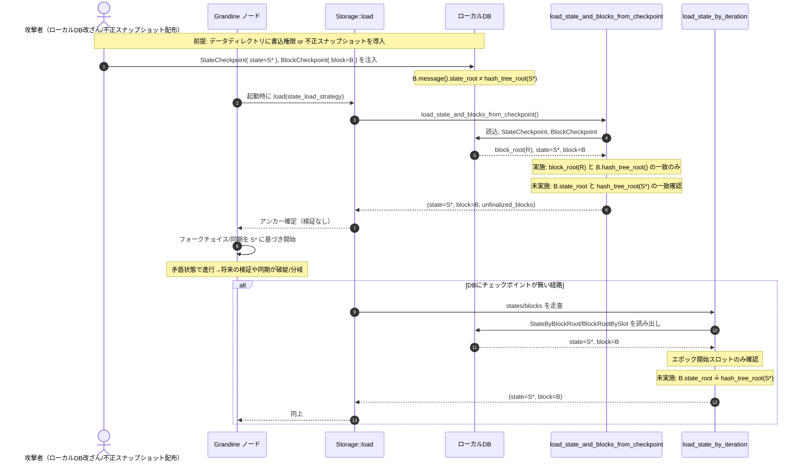

# FCC-STOR-001: ストレージ読込時の整合性未検証に関する調査レポート

## 概要と結論
- 対象: `Storage::load` によるアンカーブロック/状態の読込と、そこから遡る呼び出し関係。
- 結論: 呼び出し元（runtime/http_api 側）・呼び出し先（checkpoint_sync やローカルDB読込パス）のいずれにも、弱い主観性(WS)チェックポイント照合や、`state_root` と取得状態の `hash_tree_root()` の一致確認といった整合性検証が十分に存在しません。最小限の一貫性チェックは一部あるものの、アンカーの真正性保証としては不十分であり、脆弱性は発生し得ます。

## 該当実装と呼び出し関係
- 呼び出し元（post-load での検証の有無）
  - `runtime/src/runtime.rs: run_after_genesis` → `storage.load(...)`
    - 取得した `anchor_state`/`anchor_block` をそのまま基準として使用。追加の整合性検証なし。
  - `http_api/src/context.rs`
    - 同様に `storage.load(...)` 実行後、結果を直接利用。追加の整合性検証なし。
- 呼び出し先（`Storage::load` 内の分岐と検証状況）
  - 遠隔同期経路（`StateLoadStrategy::Remote/Auto`）
    - `fork_choice_control/src/checkpoint_sync.rs: load_finalized_from_remote`
      - `/eth/v2/beacon/blocks/{...}` と `/eth/v2/debug/beacon/states/{...}` を HTTP 取得し SSZ 復元のみ。
      - 未実装: ブロック `state_root` と状態 `hash_tree_root()` の一致検証、既知の WS チェックポイント照合、署名/証明/複数ソース照合。
  - ローカルDB経路
    - `load_state_and_blocks_from_checkpoint`
      - 実施しているチェック: StateCheckpoint に保存された `block_root` と BlockCheckpoint のブロック `hash_tree_root()` の一致確認（CheckpointBlockRootMismatch）。
      - 未実装: ブロック `state_root` と状態 `hash_tree_root()` の一致検証、WSチェックポイント照合、暗号学的な DB 整合性検証。
      - エポック開始スロット確認（PersistedSlotCannotContainAnchor）はあるが整合性としては不十分。
    - `load_state_by_iteration` / `load_latest_state`
      - エポック開始スロット確認などの軽微な検証のみ。`state_root` 一致確認や WS 照合は無し。

## リスク評価
- 発生可能性: 中〜高
  - 遠隔同期（`--checkpoint-sync-url`/`--force-checkpoint-sync`）や、破損/改ざんされたローカルストレージが起点になり得る。
- 影響度: 高
  - 誤ったアンカー固定（ロングレンジ攻撃等）、以後の同期/検証の誤誘導、あるいは不整合データによる不安定化。

## 何が不足しているか
- 既知の WS チェックポイント（ネットワーク配布の既知値）との照合がどこにも無い。
- ブロック `state_root` とロード状態の `hash_tree_root()` の一致確認が無い。
- 遠隔経路での署名/証明/複数ソース照合や応答サイズ上限チェックも無い（DoSの副次的リスク）。

## 推奨対策（優先度順）
- 必須
  - アンカー確定前に、取得ブロックの `state_root` と取得状態の `hash_tree_root()` の一致検証を追加。
  - 既知の WS チェックポイントとの照合を必須化（CLI/設定提供 or ビルド同梱）。
- 望ましい
  - 遠隔同期時の複数ソース照合（信頼先リスト＋多数決等）や署名付き配布の採用。
  - HTTP 応答の最大サイズ制限（SSZ 上限に基づく）。
  - `--checkpoint-sync-url` 使用時、WS 未指定なら起動拒否/強警告。

## 参考箇所（抜粋）
- `fork_choice_control/src/storage.rs: load(...)`（呼び出し元の後段検証なし）
- `fork_choice_control/src/checkpoint_sync.rs: load_finalized_from_remote(...)`（遠隔取得時の未検証）
- `fork_choice_control/src/storage.rs: load_state_and_blocks_from_checkpoint(...)`（一部チェックのみ）
- `runtime/src/runtime.rs`, `http_api/src/context.rs`（`Storage::load` の呼び出し元）

---
最小の是正として、`state_root` 整合チェックと WS チェックポイント照合をアンカー確定前に行う実装を追加することを強く推奨します。

## 攻撃シナリオ（Mermaid シーケンス図）

