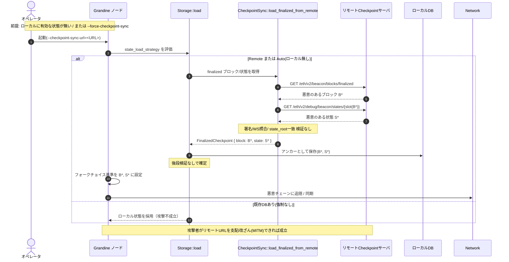

# FCC-WS-001: 弱い主観性チェックポイント同期の未検証に関する調査レポート

## 概要と結論
- 対象: チェックポイント同期で外部ノードから取得した最終化ブロック・状態を信頼アンカーとして読み込む処理。
- 結論: 呼び出し先（`checkpoint_sync::load_finalized_from_remote`）および呼び出し元（`storage::load`）のいずれにも、弱い主観性（WS）チェックポイントの暗号学的検証や、ブロック `state_root` と取得状態の対応検証が存在しない。条件を満たすと実際に発生しうる脆弱性である。

## 該当実装
- 関数: `fork_choice_control/src/checkpoint_sync.rs: load_finalized_from_remote
()`
  - 処理: 
    - `/eth/v2/beacon/blocks/{finalized|slot}` で `SignedBeaconBlock` を取得
    - `/eth/v2/debug/beacon/states/{slot}` で `BeaconState` を取得
    - SSZ デシリアライズするのみで、以下の検証が欠如
      - 取得したブロック `state_root` と状態の `hash_tree_root()` の一致確認
      - 既知の WS チェックポイント（ネットワーク毎に配布されるハードなチェックポイント）との照合
- 呼び出し元: `fork_choice_control/src/storage.rs: Storage::load()`
  - `StateLoadStrategy::Remote` → 直接 `load_finalized_from_remote` を呼ぶ
  - `StateLoadStrategy::Auto` → ローカル状態が無い・`checkpoint_sync_url` が設定時に同関数を呼ぶ（`--force-checkpoint-sync` 指定時は常に経由）
  - 受領後の処理: 取得した `anchor_block`/`anchor_state` をそのまま DB へ保存し、以後のフォークチョイスの土台として使用。追加の照合（WS、`state_root` 整合等）は行っていない。

## 呼び出し先での検証有無
- `fetch_block`/`fetch_state` → `fetch`（`reqwest` で HTTP 取得→`response.bytes()`→`SszRead`）
  - 署名や証明の検証、複数ソース照合は未実装
  - 参考: 応答サイズ上限もなく、DoS の副次的リスク（巨大応答）も内包

## トリガ条件（発生可能性）
- 初期同期でローカルに有効な状態が無いノードが `--checkpoint-sync-url` を指定して起動する場合（`StateLoadStrategy::Auto` の分岐）
- または `--force-checkpoint-sync` 指定で `StateLoadStrategy::Remote` を使用する場合
- これらの経路では、外部ノードからの応答を信頼してアンカーを確定し、後段検証は行われない

## 影響（リスク評価）
- 影響度: 高
  - ロングレンジ攻撃（弱い主観性攻撃）により、誤ったチェーンに固定される可能性
  - 取得ブロックの `state_root` と状態の対応未検証により、矛盾データで以後の処理が不安定化する可能性
- 発生可能性: 中〜高
  - 悪意ある/侵害されたチェックポイント同期サーバ、MITM 攻撃、誤設定などで発生し得る

## 推奨対策（優先度順）
- 必須
  - 取得ブロックの `state_root` と取得状態の `hash_tree_root()` の一致検証を追加
  - 既知の WS チェックポイントとの照合を必須化（ネットワーク毎の既知値を CLI/設定で提供、またはビルド時に同梱）
- 望ましい
  - チェックポイントの複数ソース照合（信頼先ホワイトリスト＋多数決 など）
  - HTTP 応答の最大サイズ制限（SSZ 上限に基づく）で DoS 回避
  - HTTPS 強制や証明書ピンニング／署名付き配布の採用
  - `--checkpoint-sync-url` 使用時に WS チェックポイント未指定なら起動拒否または強い警告

## 参考箇所（抜粋）
- `fork_choice_control/src/checkpoint_sync.rs`（`load_finalized_from_remote`・検証欠如）
- `fork_choice_control/src/storage.rs`（`Storage::load`・呼び出し元。後段検証なし）
- `grandine/src/main.rs`（`--checkpoint-sync-url`/`--force-checkpoint-sync` からの経路選択）

---
本件は「呼び出し先・呼び出し元ともに未検証」であることを確認したため、最小対処として `state_root` 整合チェックと WS チェックポイント照合を早期（アンカー確定前）に導入することを強く推奨します。

## 攻撃シナリオ

