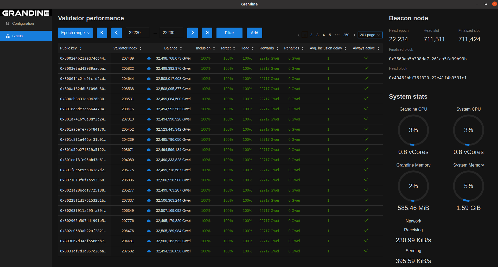

# Grandine: Parallelized Cross-Platform Proof-Of-Stake Consensus Implementation For Ethereum Networks

## Beacon Node

The Beacon Node is the main component of Grandine.
Let's try it out by syncing the Prater network on Linux:

```
docker run                              \
  -p 9000:9000/tcp                      \
  -p 9000:9000/udp                      \
  -v $HOME/.grandine:/root/.grandine    \
  sifrai/grandine:latest grandine       \
  --network prater
```

For ARM64 (Raspberry Pi) simply use dedicated docker image:

```
docker run                              \
  -p 9000:9000/tcp                      \
  -p 9000:9000/udp                      \
  -v $HOME/.grandine:/root/.grandine    \
  sifrai/grandine:latest-arm64 grandine \
  --network prater
```

## Validator

The Validator is a built-in component that is activated if validator keys are passed to Grandine.
Let's try running Grandine with a new validator enabled on the Prater network (assuming you already have keys, secrets etc.):

```
docker run                                                          \ 
  -p 9000:9000/tcp                                                  \
  -p 9000:9000/udp                                                  \
  -v $HOME/.grandine:/root/.grandine                                \
  -v $HOME/.grandine/validator_keys:/root/.grandine/validator_keys  \
  -v $HOME/.grandine/secrets:/root/.grandine/secrets                \
  sifrai/grandine:latest grandine                                   \
  --eth1-rpc-urls ETH1-RPC-URL                                      \
  --network prater                                                  \
  --keystore-dir /root/.grandine/validator_keys                     \
  --keystore-password-file /root/.grandine/secrets
```

The secret should be placed in `$HOME/.grandine/secrets` file if the same secret is used for all the keys.
Otherwise, for every keystore file in `$HOME/.grandine/validator_keys` there should be a corresponding file in the `$HOME/.grandine/secrets` directory with the secret file named the same as the corresponding keystore file except the extension should be `.txt` instead of `.json`.

For any sensitive keys it's a must to use a [remote signer](#remote-signer).

## Remote Signer

Grandine supports [Web3Signer](https://github.com/ConsenSys/web3signer) remote signer. Multiple remote signer URLs can be passed via `--web3signer-api-urls` parameter. Grandine first loads keys it finds in the directory specified by `--keystore-dir` parameter and then from the remote signers specified via the `--web3signer-api-urls` parameter. Only the first unique validator key will be loaded so the order is important if the same key appears in multiple sources. Keys from the remote signers are refreshed every epoch. Grandine runs internal slashing protection for validators specified via `--web3signer-api-urls` too.

## Slasher

The Slasher is another built-in component.
It turned off by default as it's not optimized yet.

## Slashing Protection

Grandine supports the [Slashing Protection Interchange Format](https://eips.ethereum.org/EIPS/eip-3076).
It's a must to migrate slashing protection data if you are switching between clients.
We also highly recommend waiting for a few epochs before starting validators on a new client.

## GUI

Grandine comes with an optional cross-platform Graphical User Interface.
The GUI was born from our own need to visualize validator performance so the GUI already features powerful performance tooling.
We are planning to extend the functionality significantly if the community will favor GUI.



## HTTP API

HTTP API is partially implemented.
We expect to finalize it and release API documentation in the upcoming months.

## Cross Platform

Our current focus is 64-bit [Tier 1](https://doc.rust-lang.org/nightly/rustc/platform-support.html#tier-1) platforms.
We may consider supporting a particular [Tier 2](https://doc.rust-lang.org/nightly/rustc/platform-support.html#tier-2) platforms if there is sufficient demand for it.
Even though we provide native builds for multiple platforms, we primarily test Linux builds.

## Implementation

Our goal is to deliver original implementations for such core components as fork choice.
Apart from common libraries such as cryptography or networking, Grandine doesn't follow reference implementations.
This approach has already enabled us to find vulnerabilities in all other implementations and greatly contributes to Grandine's performance.

## Performance

Grandine can sync several times faster than other implementations.
CPUs with 16 threads or more may deliver a performance increase of up to ~1000% under certain conditions.
Some optimizations are not yet implemented, so there is room for even higher performance.
Grandine should be able to utilize an arbitrary number of CPU threads in upcoming releases.

## Snapshot Sync

Grandine is designed to load from an [anchor-state](https://github.com/ethereum/eth2.0-specs/blob/a553e3b18e77db954944d76994e40fb675b48009/specs/phase0/fork-choice.md#get_forkchoice_store).
Currently, Grandine stores and loads only its own transitioned states.
We are ready to add the snapshot sync support once deposit withdrawals are available.
Until then it's not clear is it worth weakening security by bringing trusted snapshots.

## Security

We take security as seriously as performance.
We have adopted various security practices such as peer-reviews and fuzzing, we do not commit any [unsafe](https://doc.rust-lang.org/book/ch19-01-unsafe-rust.html) code, etc.

## Open Source

Grandine is funded by multiple parties such as private capital and European Union grants.
We are actively looking for options that would allow satisfying the obligations that came with these sources of funding and would allow us to open-source Grandine.

## Team

Grandine is built by [SIFRAI](https://twitter.com/sifraitech) core team led by [Saulius Grigaitis](https://twitter.com/sauliuseth).
We also involve academia in the early stages of new developments, however, the optimized production code is delivered by the core team.

## Research

Our core interest is the performance problems of proof-of-stake and sharding protocols.
Feel free to reach us if you are interested in collaborating on scientific research and peer-reviewed papers on modern scaling methods - zk-SNARKS, executable shards, cross-chains, and other techniques.

## Discord

It's best to reach us via [Grandine Discord](https://discord.gg/H9XCdUSyZd). Feel free to join!

## Old CPUs

We currently do not provide builds for older CPUs.
Let us know if you get an "Illegal instruction" error.
This will help us decide whether we should provide separate builds that support older CPUs.

## Credits

We would like to thank all developers and organizations that delivered the amazing software Grandine uses. Only a small part of [the full](Cargo.lock) [list](yarn.lock) are mentioned below:

* Async - Tokio by many developers and organizations;
* Cryptography - BLST by Supranational and others;
* Database - RocksDB, SQLite by Facebook, SQLite Consortium, and others;
* GUI - AntD, Electron.js, React.js by many contributors;
* Language - Rust by Mozilla, Rust Foundation, and others;
* Networking - Eth2 Libp2p, Rust Libp2p by Protocol Labs, Sigma Prime, Web3, and others.

## Use at Your Own Risk

THE SOFTWARE IS PROVIDED "AS IS", WITHOUT WARRANTY OF ANY KIND, EXPRESS OR IMPLIED, INCLUDING BUT NOT LIMITED TO THE WARRANTIES OF MERCHANTABILITY, FITNESS FOR A PARTICULAR PURPOSE AND NONINFRINGEMENT. IN NO EVENT SHALL THE AUTHORS OR COPYRIGHT HOLDERS BE LIABLE FOR ANY CLAIM, DAMAGES OR OTHER LIABILITY, WHETHER IN AN ACTION OF CONTRACT, TORT OR OTHERWISE, ARISING FROM, OUT OF OR IN CONNECTION WITH THE SOFTWARE OR THE USE OR OTHER DEALINGS IN THE SOFTWARE.
