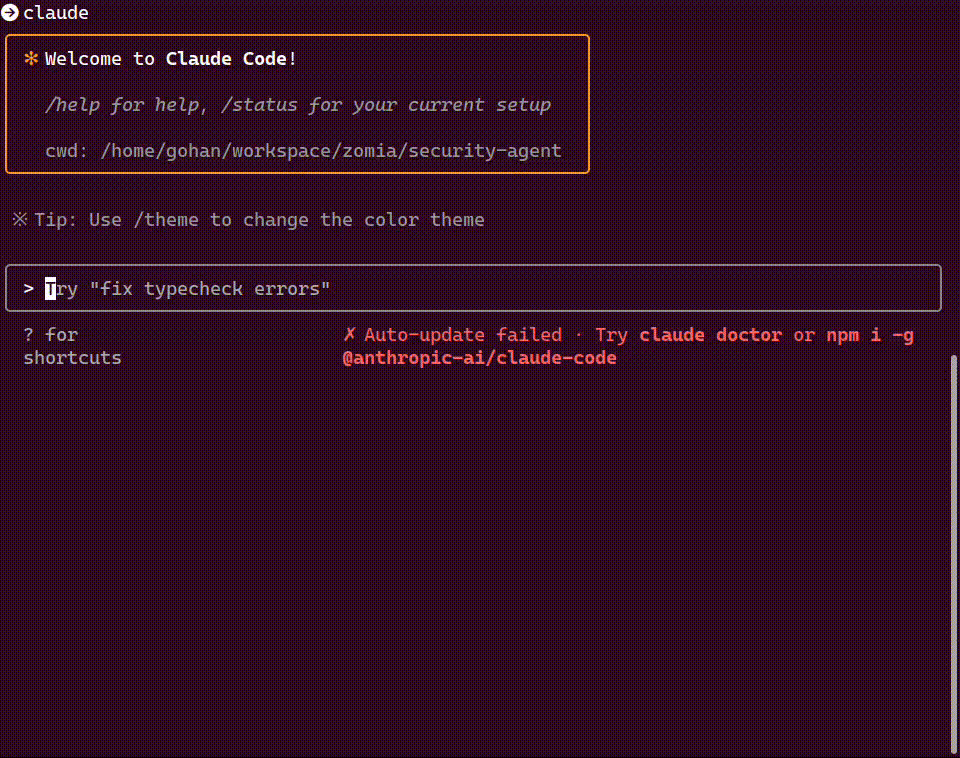

# Security Agents

An automated security analysis system using Claude Code for comprehensive Bug Bounty research and vulnerability assessment.

## Overview

This system performs multi-phase security analysis for blockchain projects, specifically designed for Bug Bounty programs. It uses Claude with WebSearch capabilities to analyze Bug Bounty scopes, technical specifications, and generate attack scenarios.

## How to use

### Launch Claude Code

```bash
git clone git@github.com:NyxFoundation/security-agent.git
rm -rf security-agent/.git
mv security-agent/.claude .claude
claude --dangerously-skip-permissions
> /security
> /01_spec ...
> /02_order ...
> /03_auditmap ...
```

Use custom slash commands for each task:



---

### Generate Callgraph (Optional)
```bash
uv sync
uv run python -m utils.static_analyzer .. --verbose
```

Navigate to the callgraphs directory and visualize specific contracts:

```bash
cd outputs/callgraphs

# Generate PNG images for key contracts
dot -Tpng PoolManager.call-graph.dot -o PoolManager.png
dot -Tpng all_contracts.call-graph.dot -o all_contracts.png
dot -Tpng Hooks.call-graph.dot -o Hooks.png
dot -Tpng Pool.call-graph.dot -o Pool.png

# Generate SVG for interactive viewing
dot -Tsvg all_contracts.call-graph.dot -o all_contracts.svg

# Generate PDF for documentation
dot -Tpdf PoolManager.call-graph.dot -o PoolManager.pdf
```